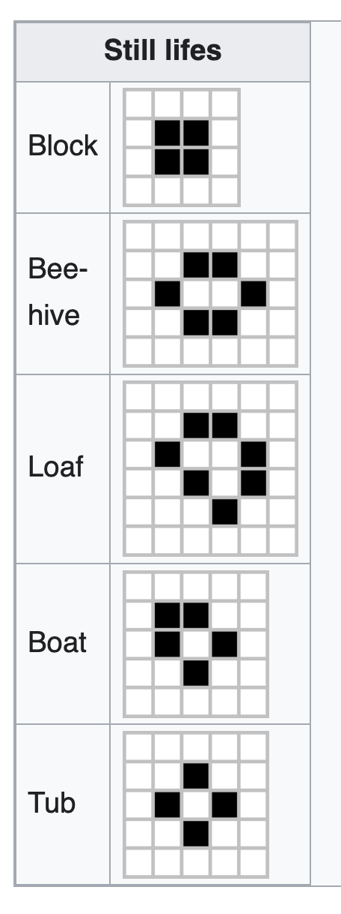
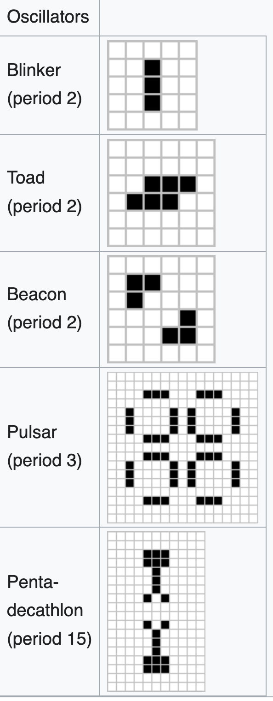
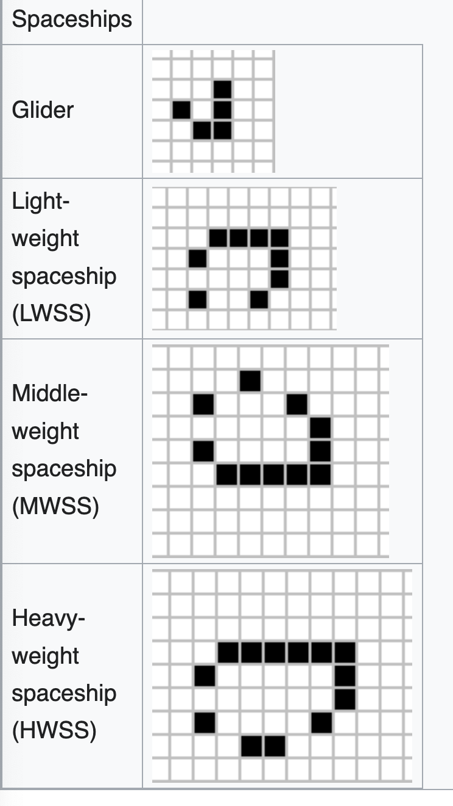
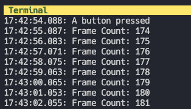
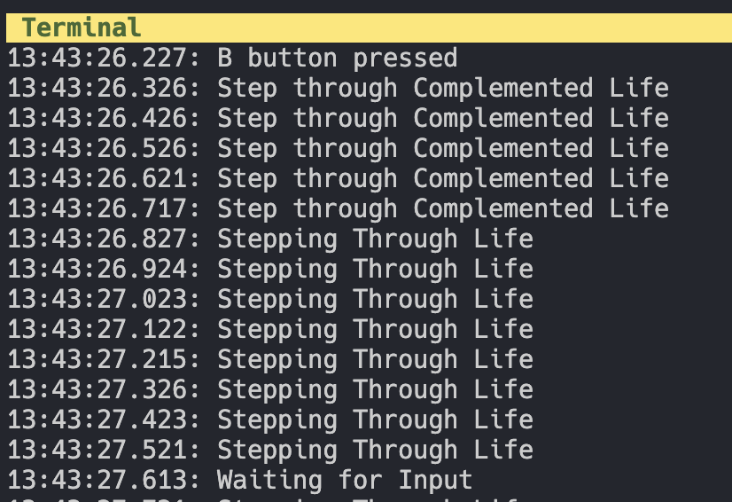

# Game Of Life Greg Witt

## Algorithm

[Conway's Game of Life](https://en.wikipedia.org/wiki/Conway%27s_Game_of_Life) The Algorithm is an interesting and beautiful which contains various osccilations and shapes that will appear within our Microbit implementations of the Game of Life Algorithm. This was kindly provided within the project in the `src/life.rs` file and imported into the project within the `main.rs` of the project. 

### Common Shapes

**Still Lifes**



**Ocillators**



**Shapeships**




the board is initialized with random positions of `0` or `1` which represent the `On` or `Off` values of the LEDs.


### Approach/Iterations 

Leverging the Code from the Discover book's **LED Roulette** Project was very helpful for the first successful iteration of the code logic. As well as the provided `life.rs` implementation which offered the `life()` which will iterate the steps of the grid passed as a `&mut light_matrix` which will take the board and it's lights from the peripherials.

leveraging the `microbit crate` in the following to pass the peripherials to the `board`

```rust
 // Take the board from the BSP
    let board = Board::take().unwrap();
```

I also created references to the board's `timer` and `display` just as was done from the discovery book for **LED Roulette**. I also aquired the on board `Random Number Generator`

```rust
// aquire the time/display and hardware's RNG
    let mut timer = Timer::new(board.TIMER0);
    let mut display = Display::new(board.display_pins);
    let mut hw_rng = HwRng::new(board.RNG);
```

**Light Matrix**

Another approach taken from the text was to aquire the `light_matrix` which represents the field of booleans `0` or `1`s that are used to turn off and on the matrix.
mutable so that they can be modified to be either *off or *on*. 

```rust
let mut light_matrix = [
        [0u8, 0u8, 0u8, 0u8, 0u8],
        [0u8, 0u8, 0u8, 0u8, 0u8],
        [0u8, 0u8, 0u8, 0u8, 0u8],
        [0u8, 0u8, 0u8, 0u8, 0u8],
        [0u8, 0u8, 0u8, 0u8, 0u8],
    ];
```

**Snatching the Buttons**

taking the buttons from the board is fairly self explanitory

```rust
    let mut a_button = board.buttons.button_a;
    let mut b_button = board.buttons.button_b;
```

I also logged the responses to ensure that everything was correct in the output. leveraging Frame counters and also a `Step through Complemented Life` loop. all of this was possible with the `rprintln!()` macro from the `rrt_target` with `use rtt_target::{rprintln, rtt_init_print};`

**A Button**



**B Button** 



### Life Loop Magic

the entire program runs through a large loop. to control the display mehtod and the loop logic's done state, as instructed. 

the process of the controllers are controlled with the following logic.

#### A Button Pressed: 

`randomize_board` is called. which takes a copy of the board and modifies each position from the `nanorand` crate to produce random instances of `1u8` *On* and or `0u8` *Off* states of the board. 

I am leveragin the `let b: bool = rng.generate();` to determine if they should be made *1* or *0* based on the boolean response.

I am also using the hardward's random number generator to produce a random_u32 seed.

```rust 
fn randomize_board(light_matrix: &mut [[u8; 5]; 5], hw_rng: &mut HwRng) {
    let mut rng = nanorand::Pcg64::new_seed(hw_rng.random_u32().into());
    for light in light_matrix.iter_mut().flat_map(|r| r.iter_mut()) {
        let b: bool = rng.generate();
        *light = if b { 1u8 } else { 0u8 };
    }
}
```

#### B Button Pressed:

*Complement Board* will happen when the B button is pressed. allowing a loop of 5 frames that will first step through the game of life and then block other actions from occuring as it's nested inside of the `if b_pressed` boolean state. basically locking the actions within this execution loop, after `complement_board` is called. which leverages a new intersting way of iterating through a loop with a `flat_map()` and a closure that iterates through the nested columns and rows.

**Instance of B Pressed Logic**

```rust
else if b_pressed {
            rprintln!("B button pressed");

            complement_board(&mut light_matrix);

            display.show(&mut timer, light_matrix, FRAME_DURATION.into());

            for _ in 0..5 {
                rprintln!("Step through Complemented Life");
                life(&mut light_matrix);

                display.show(&mut timer, light_matrix, FRAME_DURATION.into());
            }
        }
```

**Complement Board Method**

```rust
// Complements the current board being displayed
fn complement_board(light_matrix: &mut [[u8; 5]; 5]) {
    for light in light_matrix.iter_mut().flat_map(|r| r.iter_mut()) {
        *light = if *light == 1u8 { 0u8 } else { 1u8 };
    }
}
```


### No Action (Randomize Board):

If *No Action* ie (A not pushed or B not pushed), and there is a `done()` state meaning everthing on the board is a `0` then it's time to randomize the board after waiting 
all leveraging the final `else if`

```rust
 // Check if all lights are out
else if done(&light_matrix) {
    rprintln!("Stable State");
    rprintln!("Waiting for Input");
    timer.delay_ms((500 * FRAME_DURATION).into());
    randomize_board(&mut light_matrix, &mut hw_rng);
}
```


### Main Loop

```rust
randomize_board(&mut light_matrix, &mut hw_rng);

    loop {
        let a_pressed = a_button.is_low().unwrap();
        let b_pressed = b_button.is_low().unwrap();

        // A Button: Randomize the board display
        if a_pressed {
            rprintln!("A button pressed");
            rprintln!("Randomizing Board");
            randomize_board(&mut light_matrix, &mut hw_rng);
        }
        // B Button: Ignore the 'B' button for 0.5s post press
        else if b_pressed {
            rprintln!("B button pressed");

            complement_board(&mut light_matrix);

            display.show(&mut timer, light_matrix, FRAME_DURATION.into());

            for _ in 0..5 {
                rprintln!("Step through Complemented Life");
                life(&mut light_matrix);

                display.show(&mut timer, light_matrix, FRAME_DURATION.into());
            }
        }
        // Check if all lights are out
        else if done(&light_matrix) {
            rprintln!("Stable State");
            rprintln!("Waiting for Input");
            timer.delay_ms((500 * FRAME_DURATION).into());
            randomize_board(&mut light_matrix, &mut hw_rng);
        }

        // Step through life
        rprintln!("Stepping Through Life");
        life(&mut light_matrix);

        display.show(&mut timer, light_matrix, FRAME_DURATION.into());
    }
```


## Documentation 

[Discover Embedded LED Roulette](https://docs.rust-embedded.org/discovery-mb2/08-led-roulette/my-solution.html)
[Embedded Rust Book](https://docs.rust-embedded.org/book/start/panicking.html)
[Flat Map](https://doc.rust-lang.org/std/iter/struct.FlatMap.html)