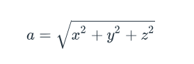
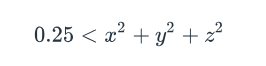

# Drop Greg Witt

## What Was Developed

In this assignment I developed a **single super loop section** to continue checking for the operations of the accelerometer. when the device is able to send accelerometer data to our loop. I am calculating the result to determine which direction in the Z axis the microbit is oriented, which I will get into more detail about shortly, and then making a noise iteratively while the board is calculated/determined to be falling. 

### Established Displays

There are two display elements I am leveraging for this project. 

established as the blocking style display with the following imports:

```rust
use microbit::{
    board::Board,
    display::nonblocking::{Display, GreyscaleImage},
    hal::{
        delay::Delay,
        gpio::Level,
        pac::{self, TIMER1, interrupt, twim0::frequency::FREQUENCY_A},
        timer::Timer,
        twim,
    },
};
``` 

there is ALOT to unpack here but the basic imports are the `display::nonblocking` elements, leveraging the `Display` and `GreyscaleImage`

with these imports I take the state of the display and set it into a static variable

```rust
/// The display is shared by the main program and the
/// interrupt handler.
static DISPLAY: LockMut<Display<TIMER1>> = LockMut::new();
```

the implementation of the displays is simple as before with the other homeworks that relied on the displays, but this time we need to swap between the two as actions have occurred. 

**Happy Face (Not Falling) :)**

this display was designed leveraging some gray scale techniques to adjust the suble brightness of the device's face. creating the brightes with the `9` value. this `happy_image` will be later called when I change the display for the falling event. 


```rust
   let happy_image = GreyscaleImage::new(&[
        [0, 0, 0, 0, 0],
        [0, 9, 0, 9, 0],
        [0, 0, 0, 0, 0],
        [9, 0, 0, 0, 9],
        [0, 9, 9, 9, 0],
    ]);
```


**! Falling (:scream:)**

the falling face or `drop_image` was created in a similar way with the `GreyscaleImage` but with a different pattern, to represent the `!` or (ohh :poop:, I'd better catch my microbit). this is also going to help us when we are using the interrupts to change the display later on down the logic when calculating the position of the accelerometer.

```rust
 let drop_image = GreyscaleImage::new(&[
        [0, 0, 9, 0, 0],
        [0, 0, 9, 0, 0],
        [0, 0, 7, 0, 0],
        [0, 0, 0, 0, 0],
        [0, 0, 9, 0, 0],
    ]);
```

**Microbit Displayed Version**

*I had to throw it a couple times to get this (thank heavens for cases)* 


## Making some Noise 

in order to leverage the speaker and get this difficult section of the program out of the way I established the connection to the `microbit`'s `board::Board` which allows direct access to the `speaker_pin` I established a connection and association to a **mutable instance** of the speaker as I needed to turn it on and off for the project. setting the inital value to `Low` for off.

**Speaker Instance**

the basics for importing the speaker and getting it set into the main loop.

```rust
// import the board from the crate.
use microbit::{board::Board};
// time delay for the speaker to flutter on and off.
use hal::{delay::Delay};

// import the crate to leverage the speaker peripherals
let mut board = Board.take().unwrap()

// set the mut speaker for later turning on/off and making a screech.
let mut speaker = board.speaker_pin.into_push_pull_output(Level::Low);
```

:+1: okay now that we've covered how to set up the speaker making it screeeem was the fun part. 

within the logic of the accelormeter, I leveraged a timing loop to ensure that the device made consistent noise, otherwise it will just make a small click, instead of make continuous noise. *note a small delay is used to flutter off and on*

**Scream Loop :scream:**

I played with the `1..1000` to ensure some consistency with timing of the cycles.

```rust
for _ in 1..1000 {
    speaker.set_high().unwrap();
    delay.delay_us(500);
    speaker.set_low().unwrap();
    delay.delay_us(500);
}
```

## Calculating Free Fall

This was the most difficult part of the assignment for me. determining the calculation wasn't the easiest thing to figure out. I settled on the following:

```rust
// obtain values from the sensor as milliGravities
let mut x_value = data.x_mg();
let mut y_value = data.y_mg();
let mut z_value = data.z_mg();

let acceleration_vector = i32::pow(x_value,2) + i32::pow(y_value,2) + i32::pow(z_value,2);
// converts to G's and compares to the 0.5 ^ 2 = [.25 * 1000] ~> 250 (compared to 1000)
let is_it_falling: bool = (acceleration_vector/1000) < 250;
```

basically I have the `x, y, z` values from the accelerometer cast to `n_mg()` to get the `milliGravities` from the sensor. I thought this was easier I am taking the calculation and returning the value into the value `is_it_falling` which is a boolean to represent the comparison of the the acceleration_vector is everything under the radical from the homework's calculation of `magnitude of acceleration`. I then compare it to `250` for sensitivity after determining it's gravity equivalent after `acceleration_vector/1000` this threshold of `250` seemed to work very well for the sensor.

**Magnitude of Acceleration**



I leveraged this option 

**Simple Acceleration Equation**

this method makes things much easier.

 

**What Happens if `is_it_falling` is True**

This is where we put everything together. within the loop to encompass the displays and the noise.

clearly when it's falling it needs to make some kind of noise. to do this we will leverage our loop from the previous section, when it falls it also needs to change the display. and interrupt will be required as it is `nonblocking`. here is the whole juicy element to the super loop.

```rust
if is_it_falling {
        rprintln!("Falling Detected: {}", is_it_falling);
        
        DISPLAY.with_lock(|display| display.show(&drop_image));
        timer2.delay_ms(100u32);

        for _ in 1..1000 {
            speaker.set_high().unwrap();
            delay.delay_us(500);
            speaker.set_low().unwrap();
            delay.delay_us(500);
        }
    } else {
        DISPLAY.with_lock(|display| display.show(&happy_image));
        timer2.delay_ms(100u32);
    }

    DISPLAY.with_lock(|display| display.clear());
    timer2.delay_ms(100u32);    
```

basically I am checking for the truth of the microbit falling. if it is I am setting an interupt call to swap the display into the `!` and then looping through the speaker to get it to screech. if it isn't falling it will then keep the `happy_image`

after each loop it clears to get the board to "flash" making it easier to just flash a `happy_image` or a `!` as we desire.


## How Was The Development Process Went

I started by throwing together the display. designing a `!` and then the :)

after that I added the sound module from the imported onboard `board.speaker_pin` and added a push pull to toggle the noise. I was struggling to only get a small click noise on the board at first but was later able to get it to hold the tone while falling with an `if conditional check` for the changed position in the accelerometer. this was difficult to determine how the interrupts would correspond with the changes for the logic. It was easier to reference the documentation for the punch o meter to get the gist of how to build the implementation.

I was mainly stuck on the logic for the conversion and doubted myself when setting up the calculation and conversion from `mG` for comparison. 

After I was able to determine the microbit was fallling it was a struggle to get the noise to not just be a click. I had to loop through the clicks to get it to screech.

overall this was a ton of fun, and I feel like I learned alot. 


### Documentation

**For Display Logic**

[Mb2-GrayScale](https://github.com/pdx-cs-rust-embedded/mb2-grayscale)

**For Audio Logic**

[Hello Audio](https://github.com/pdx-cs-rust-embedded/hello-audio)

**For Accelerometer**  

[LSM303AGR Crate](https://crates.io/crates/lsm303agr)  
[Punch-o-meter](https://docs.rust-embedded.org/discovery-mb2/13-punch-o-meter/my-solution.html)  
[I2C Accelerometer Example](https://github.com/eldruin/driver-examples/blob/master/microbit/examples/lsm303agr-accel-mb.rs)