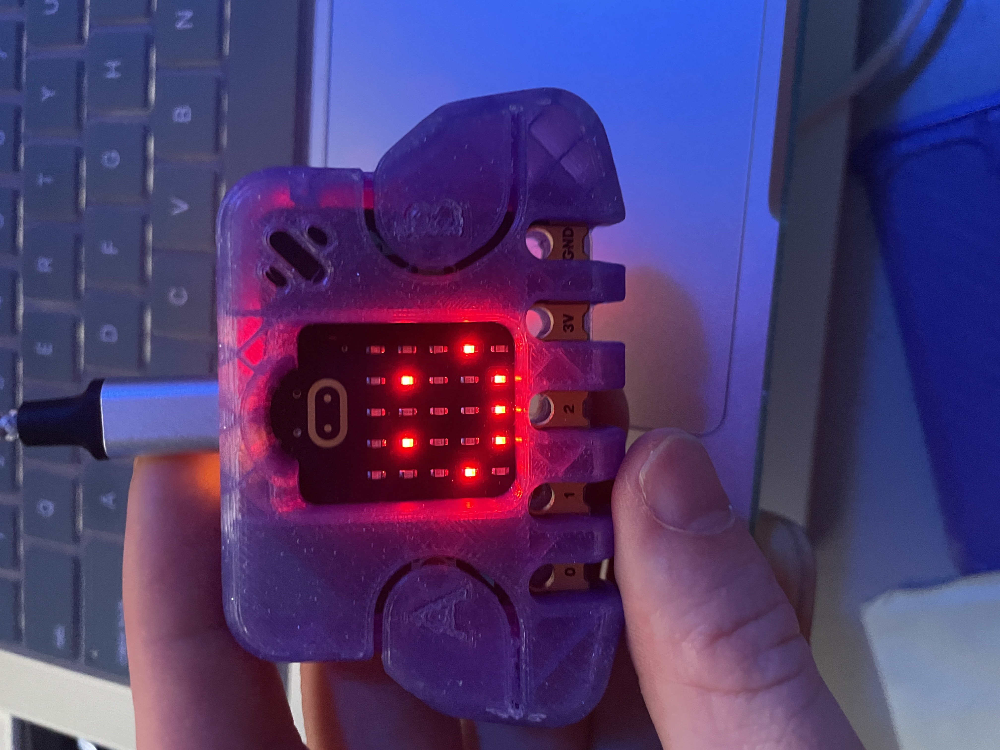
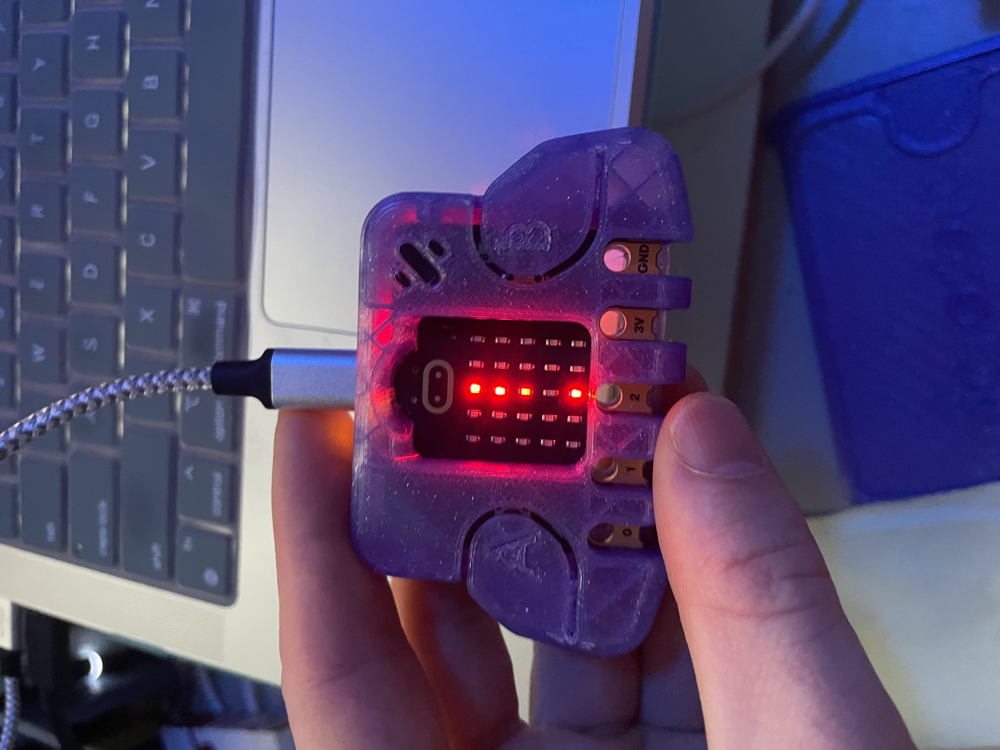

# Drop Greg Witt

## What Was Developed

In this assignment I developed a **single super loop section** to continue checking for the operations of the accelerometer. when the device is able to send accelerometer data to our loop. I am calculating the result to determine which direction in the Z axis the microbit is oriented, which I will get into more detail about shortly, and then making a noise iteratively while the board is calculated/determined to be falling. 

### Established Displays

There are two display elements I am leveraging for this project. 

established as the blocking style display with the following imports:

```rust
use microbit::{
    board::Board,
    display::nonblocking::{Display, GreyscaleImage},
    hal::{
        delay::Delay,
        gpio::Level,
        pac::{self, TIMER1, interrupt, twim0::frequency::FREQUENCY_A},
        timer::Timer,
        twim,
    },
};
``` 

there is ALOT to unpack here but the basic imports are the `display::nonblocking` elements, leveraging the `Display` and `GreyscaleImage`

with these imports I take the state of the display and set it into a static variable

```rust
/// The display is shared by the main program and the
/// interrupt handler.
static DISPLAY: LockMut<Display<TIMER1>> = LockMut::new();
```

the implementation of the displays is simple as before with the other homeworks that relied on the displays, but this time we need to swap between the two as actions have occurred. 

**Happy Face (Not Falling) :)**

this display was designed leveraging some gray scale techniques to adjust the suble brightness of the device's face. creating the brightes with the `9` value. this `happy_image` will be later called when I change the display for the falling event. 


```rust
   let happy_image = GreyscaleImage::new(&[
        [0, 0, 0, 0, 0],
        [0, 9, 0, 9, 0],
        [0, 0, 0, 0, 0],
        [9, 0, 0, 0, 9],
        [0, 9, 9, 9, 0],
    ]);
```



**! Falling (:scream:)**

the falling face or `drop_image` was created in a similar way with the `GreyscaleImage` but with a different pattern, to represent the `!` or (ohh :poop:, I'd better catch my microbit). this is also going to help us when we are using the interrupts to change the display later on down the logic when calculating the position of the accelerometer.

```rust
 let drop_image = GreyscaleImage::new(&[
        [0, 0, 9, 0, 0],
        [0, 0, 9, 0, 0],
        [0, 0, 7, 0, 0],
        [0, 0, 0, 0, 0],
        [0, 0, 9, 0, 0],
    ]);
```

**Microbit Displayed Version**

*I had to throw it a couple times to get this (thank heavens for cases)* 




## How Was The Development Process Went

I started by throwing together the display. designing a `!` and then the :)

after that I added the sound module from the imported onboard `board.speaker_pin` and added a push pull to toggle the noise. I was struggling to only get a small click noise on the board at first but was later able to get it to hold the tone while falling with an `if conditional check` for the changed position in the accelerometer.

## Observations


### Documentation

**For Display Logic**

[Mb2-GrayScale](https://github.com/pdx-cs-rust-embedded/mb2-grayscale)

**For Audio Logic**

[Hello Audio](https://github.com/pdx-cs-rust-embedded/hello-audio)

**For Accelerometer**  

[LSM303AGR Crate](https://crates.io/crates/lsm303agr)  
[Punch-o-meter](https://docs.rust-embedded.org/discovery-mb2/13-punch-o-meter/my-solution.html)  
[I2C Accelerometer Example](https://github.com/eldruin/driver-examples/blob/master/microbit/examples/lsm303agr-accel-mb.rs)